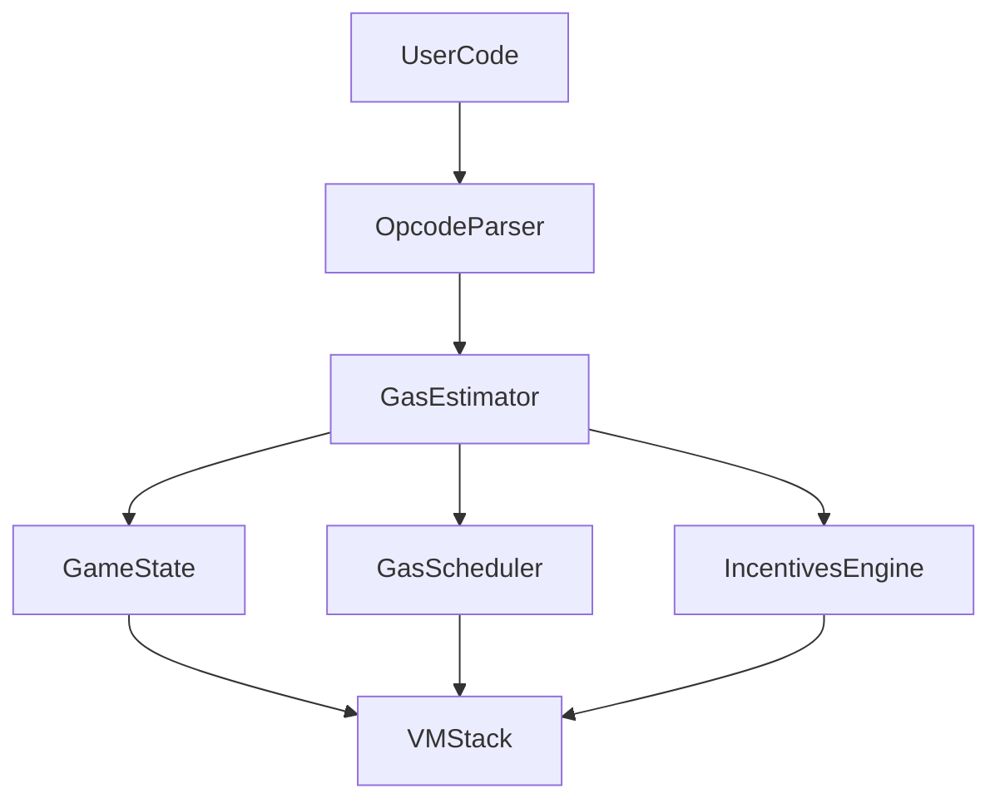

# GMVM

(Note: Due to time and health issues of team members, code was submitted incomplete and untested for ETHDenver submission)

With the GMVM we want to conceptualize a standardized game development ecosystem where game creators can build configurable game-optimized rollups that comes with an effective execution engine out the box.

## Architecture

### World State

Enables shared state among deployed game-chains and bridging of assets and data.
Each game instance is operated within its game-chain
Stores VM compiled mechanics from game-chains, identities, assets, etc

### VM

Optimized for on-chain game development and handles executing gas calculations for complex and conditional game mechanics.

- Custom opcodes
- Gas calculation
- Incentives engine
- Conditions evaluation

#### Gas Calculation

#### Incentives engine

This component is responsible for incentivizing players to create balanced abilities. It uses the gas cost of executing an ability to determine the reward that the player will receive for creating the ability. This reward can be adjusted based on the power level and custom conditions of the ability, as well as the current state of the game.

1. **Incentives configuration**: This component would define the rules and parameters for the incentive system, including things like the maximum amount of reward tokens that can be minted, the time period for the incentives program, the target behavior(s) to incentivize, and the metrics used to measure the desired behavior(s).
2. **Behavior tracking**: This component would track the behavior of users or game characters that participate in the incentivized system. It would record things like successful ability use, successful steal attempts, etc. in order to determine when rewards should be granted.
3. **Metrics calculation**: Based on the behavior tracked in step 2, this component would calculate the metrics used to measure the desired behavior(s) identified in step 1. For example, it might calculate the number of successful ability uses per day or the number of successful steals per week.
4. **Reward calculation**: Using the metrics calculated in step 3, this component would determine the amount of reward tokens that should be distributed to each participant. This might involve a formula that takes into account factors like the number of participants, the total amount of rewards available, and the performance of each participant.
5. **Token minting**: Once the reward calculation is complete, this component would mint the appropriate number of reward tokens and distribute them to the participants.
6. **Token redemption**: Finally, this component would allow participants to redeem their reward tokens for other in-game items or perks. It would also keep track of how many tokens have been redeemed and how many are still available.

#### Conditions evaluation

This component is responsible for evaluating custom conditions that have been set for an ability. It uses the current state of the game and any relevant player actions to determine whether the conditions have been met, and modifies the execution state of the virtual machine accordingly.

### SDK

Spin up a game-chain to power a new game ecosystem that gets shared to the World State and comes packaged with the custom VM.

- Abstracted smart contract runtimes for optimal cross-compatibility
- Sovereign chain governance address
- Cross-chain executables
- Abstracted gas/fee management

### Tooling 

Game creators can bring their own preferred development and runtime environment. GMVM will aim to be compatible with 